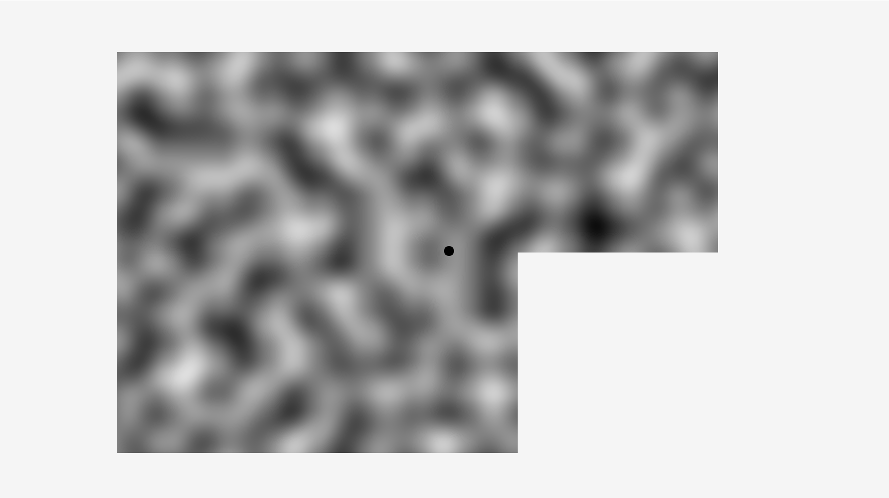

# Tiled Perlin Noise Implementation

### Unique hashing designed for procedural generation
---

**How to run:**
Note: python must be installed
Required python modules:
>raylib
>numpy
>PIL

Once downloaded, navigate to the directory, open terminal, and run
>python display.py

Alternatively
>python3 display.py

Once open the WASD keys will move a small dot around the screen.

Each time it is run a unique noise map will be generated. The procedural implementation builds off of Perlin's original permutation table, replacing it with a hashing function. This hashing function combines a random seed value and a grid coordinate to generate perlin noise values for one grid cell, or chunk. The chunks are then rendered next to each other to create a seamless noise image. This example implementation only displays 5 chunks. But, with minor additions the chunks can be rendered on an as needed basis as the user moves around the screen.

### Example Image

