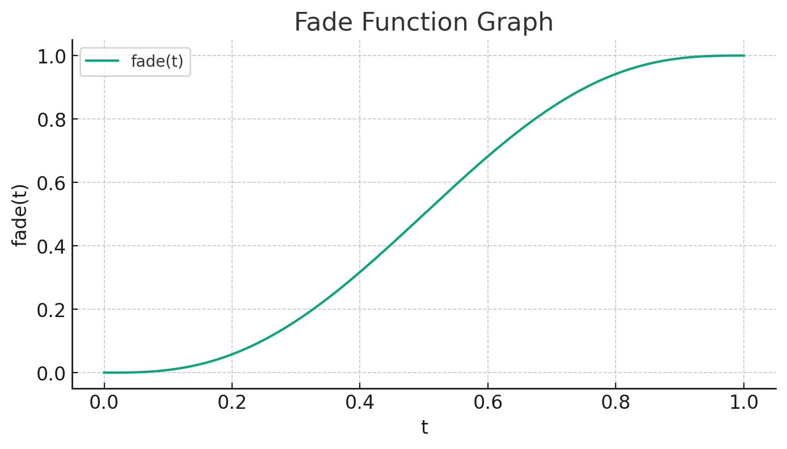

# Tiled Perlin Noise Implementation

### Unique hashing designed for procedural generation
---

**How to run:**
Note: python must be installed
Required python modules:
>raylib
>numpy
>PIL

Once downloaded, navigate to the directory, open terminal, and run
>python display.py

Alternatively
>python3 display.py

Once open the WASD keys will move a small dot around the screen.

### Watch the demo!!!
https://github.com/RossKlein/Tiled-Perlin-Noise/assets/11377562/92541319-dd42-4866-990c-9a10746002c4)

### Breakdown of tile_noise_generator.py
Each time the program is run, a unique noise map will be generated. The procedural implementation builds off of Perlin's original gradient vector operation. A grid of points is created where each are assigned a random direction. Pixels in the forward direction of a gradient point are made darker while pixels behind a gradient point are lighter. For speed, the direction is assigned via a lookup table with 8 direction options. This was an optimization perlin used. The grid points are then given a weight using a quintic fade function. The weight value is then applied as each vector in a box, top-left, top-right, bottom-left, bottom-right, is interpolated between. Each pixel is then assigned a value based on the calculated gradient. 

Calculating the gradient is the most process intensive step of the application. Numpy was used to vectorize the computations. My first implementation looped through each pixel to calculate its value. This was extremely inefficient. Instead, the calculations can be done all at once by performing the operations on numpy arrays. Numpy meshgrid was an extremely useful data structure to use, allowing me to easily create a grid data structure to operate on. Numpy vectorize was also invaluable, allowing me to apply a function to an entire array of numbers in one step. Though, I have read that vectorize is not actually parallelized code. A better implementation would be to use a compute shader, leveraging the parallel processing of the GPU, to perform these calculations. But, this is a python project. 

The hashing function combines a random seed value and a grid coordinate to generate perlin noise values for one tile. SHA256 is used as the hashing function. Modern implementations of SHA256 are extremely fast. The use case for SHA256 to generate perlin noise values is for its psuedo-randomness, small changes in x and y will give significantly different hash outputs, and yet it is still reproducible, regenerating unloaded tiles is possible.

### Breakdown of display.py

A standard game engine architecture is used. There are two threads, the main thread and the update thread. The main thread contains the graphics context and performs all GPU calls. The update thread handles input and computation routines like tile boundary checking. A rudimentary rendering system is implemented to improve the efficiency of the program. This is all handled in the checkBounds function. The check bounds function keeps track which tiles the dot is inside of and which ones are nearby. The intersected tile is flagged to be highlighted. Tiles which are in 'render distance' are flagged to be drawn. Tiles which are 'out of render distance' are flagged to be removed in the next frame. The program keeps track of render objects in a renderlist which is shared between the threads. The update thread will add tiles when the dot is no longer intersecting a tile in the renderlist. The render thread will loop through the renderlist, remove tiles flagged as expired and unload their texture from the GPU, and render tiles which are flagged as in render range. The update loop is regulated by a simple delta time implementation. This is done to free the movement speed from the framerate. The movement speed is scaled by the time taken between frames, ensuring that longer frame times does not change the distance traveled. Though, it is a rudimentary time keeping implementation.
